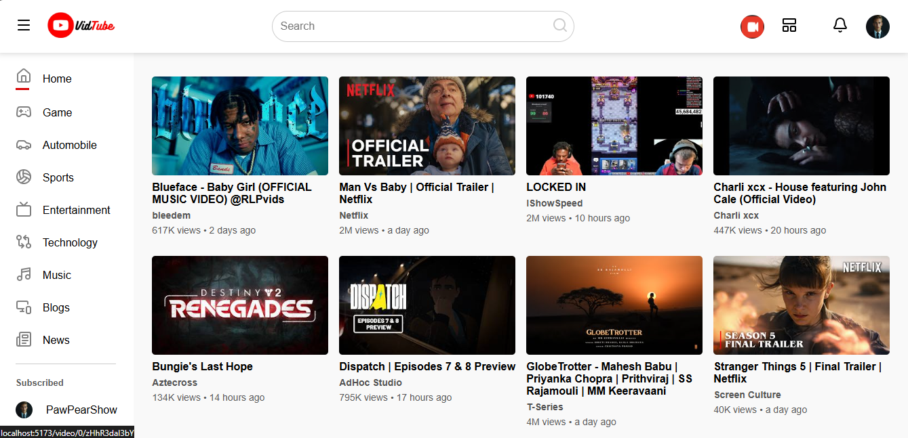
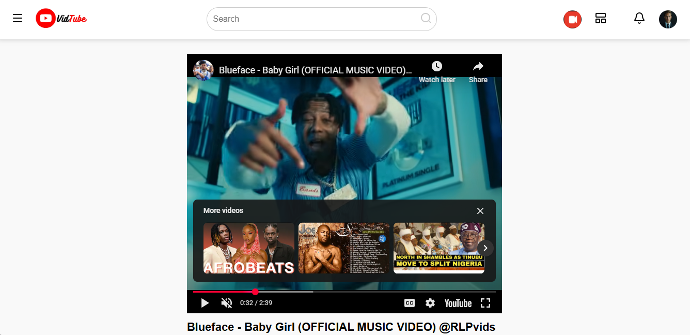

# VidTube

Vidtube App from youtube clone App with React js and youtube API
This project is a youtube clone application that allows users to watch movie of any category people, using the react js and youtube API.

The application is built using React js a popular JavaScript framework for building web applications.
The youtube API is used to get data from youtube.
fetch is used to make API requests to the backend.
The application can be customized and extended to include additional features or functionality.
The application can be used as a learning resource for those interested in building movie / video applications or similar projects.

## Project Setup

To run this project on your local machine, follow these steps:

Clone the repository using git clone https://github.com/Knackstechdevs/VidTube
Install dependencies using npm install
install react-router-dom, lucide-react and moment
Start the development server using npm run dev

## Features

Users can watch any movie found on youtube video on it for free.
Users can change to different video category on it.
To use the application, follow these steps:

just open the link and you are good to go as long as there is network connection available

## Screenshots

App Screenshot

App Screenshot

App Screenshot

Support
If you have any questions or comments about this project, feel free to reach out to me via email at Sulaimon Abdulbasit.

# React + Vite

This template provides a minimal setup to get React working in Vite with HMR and some ESLint rules.

Currently, two official plugins are available:

- [@vitejs/plugin-react](https://github.com/vitejs/vite-plugin-react/blob/main/packages/plugin-react) uses [Babel](https://babeljs.io/) (or [oxc](https://oxc.rs) when used in [rolldown-vite](https://vite.dev/guide/rolldown)) for Fast Refresh
- [@vitejs/plugin-react-swc](https://github.com/vitejs/vite-plugin-react/blob/main/packages/plugin-react-swc) uses [SWC](https://swc.rs/) for Fast Refresh

## React Compiler

The React Compiler is not enabled on this template because of its impact on dev & build performances. To add it, see [this documentation](https://react.dev/learn/react-compiler/installation).

## Expanding the ESLint configuration

If you are developing a production application, we recommend using TypeScript with type-aware lint rules enabled. Check out the [TS template](https://github.com/vitejs/vite/tree/main/packages/create-vite/template-react-ts) for information on how to integrate TypeScript and [`typescript-eslint`](https://typescript-eslint.io) in your project.
